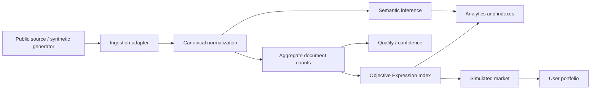

# Data flow

Raw future sources implement `ExpressionDataSource.fetchBatch`, `normalize`, and `validate`. Aggregates are hour × platform × expression × language × context. The intended persistence surface stores counts and approximate distinct-author statistics rather than a surveillance archive of usernames and post bodies.
