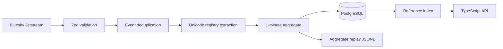

# Live ingestion

The worker reconnects with exponential backoff, resumes from a persisted microsecond cursor, and rewinds slightly to favor duplicates over gaps. A deterministic event digest removes replay duplicates. Shutdown flushes complete aggregate state and checkpoints before exit.

Raw event text and actor IDs are transient. The durable row is window × source × content bucket × expression, including eligibility, presence, occurrences, unique-author estimate, concentration, source health, and version provenance. A disconnect changes health state; it never produces an apparently ordinary zero-usage window.
