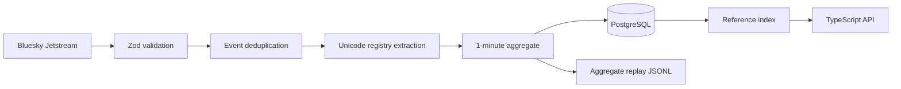

# Live ingestion

The worker reconnects with exponential backoff, resumes from a persisted microsecond cursor, and rewinds slightly to favor duplicates over gaps. A deterministic event digest removes replay duplicates. Shutdown flushes complete aggregate state and checkpoints before exit.

Raw event text and actor IDs are transient. The durable row is window × source × content bucket × expression, including eligibility, presence, occurrences, unique-author estimate, concentration, source health, and version provenance. A disconnect changes health state; it never produces an apparently ordinary zero-usage window.

## Post → expression attribution

A like, repost, reply, or quote is attributed to an expression by resolving its subject/target post through `AttributionStore` (`apps/worker/src/attribution.ts`). Every identity is an HMAC-SHA256 digest of the underlying `at://` URI (keyed by `CULT_CASCADE_HASH_SECRET`), never the raw URI, extending the same privacy-conscious scheme already used for the JSONL behavior tape. Rows persist in `post_attribution_map` (`packages/db/migrations/005_phase4_1_attribution.sql`) for `CULT_ATTRIBUTION_RETENTION_DAYS` (**default 14 days**), so engagement referencing a post created before the current worker process started — or occurring well after that post's creation — can still resolve, up to retention. On startup the worker warm-starts its in-memory cache from durable rows before consuming live events (`AttributionStore.restore()`), keeping the parser's hot-path lookups synchronous.

Coverage is measured, not assumed: `SourceHealth.mappedEngagementEvents` / `eligibleEngagementEvents` count every observed engagement event and how many resolved, and are exposed as `mappedEngagementRate` on `GET /api/v1/data/status`. An engagement outside the retention window, or referencing a post this deployment never observed, is counted as unmapped rather than silently dropped. `CULT_CASCADE_HASH_SECRET` must be stable across restarts for durability/warm-start to work; without it the store still functions but falls back to an in-memory-only, process-local mode (logged once at startup).
