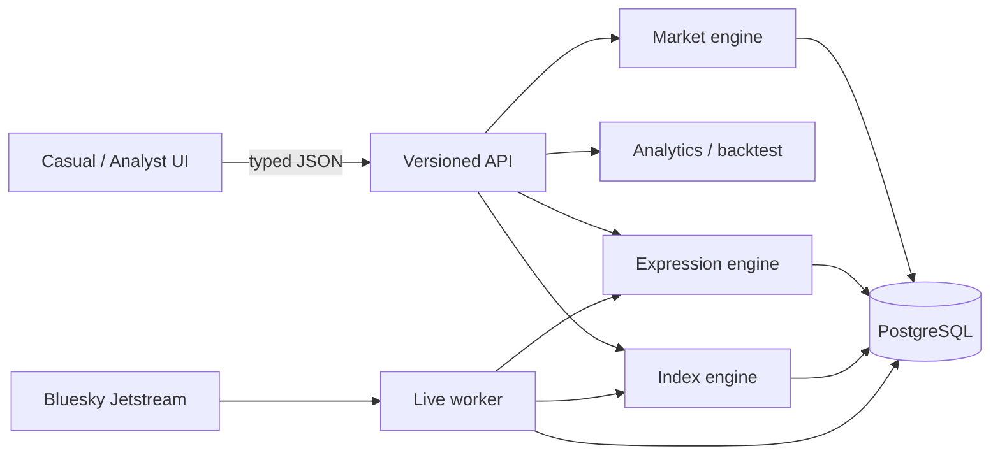

# System overview

The product/API remains a TypeScript modular monolith. Live measurements flow through an aggregate-only worker into PostgreSQL; default demo trading remains memory-backed. Quantitative primitives are migrating behind parity tests into modular C++20 libraries, with coarse Node-API and Python research boundaries. Domain packages have no UI dependencies.

The dependency direction is strict: sources create objective aggregates and references; analytics and the simulated market consume them. Semantic inference and user trading can never alter official expression counts.
