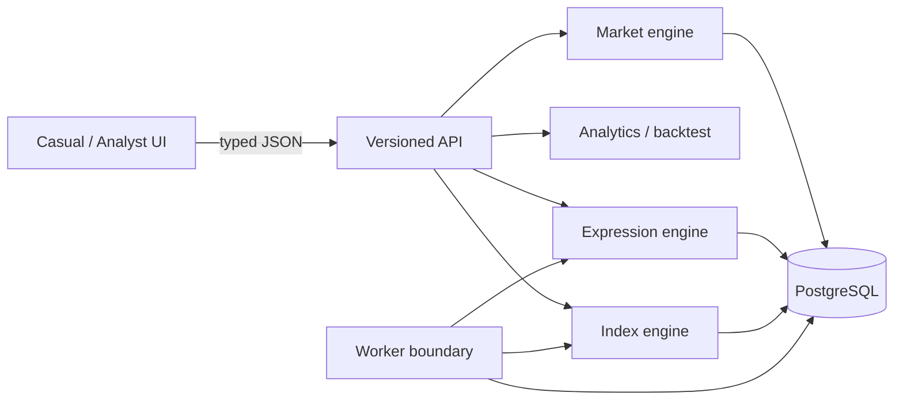

# System overview

V0 runs the API as a modular monolith. Domain packages have no UI dependencies and expose replacement boundaries for data sources and execution. Runtime demo state is memory-backed; the PostgreSQL schema is ready for repository adapters in the next phase. This choice makes the entire product runnable without pretending operational complexity is product value.
